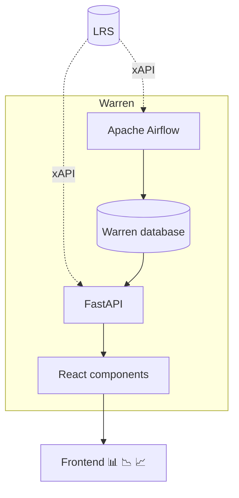

# Warren is born with xAPI

How to make data visualization with an LRS?

## Architecture

💾 LRS as the primary data source  
📦 FastAPI backend serving indicators  
🧮 Apache Airflow for complex indicators calculation  
📊 React frontend components for charts

## Extensibility

- plugin architecture (backend)
- npm packages (frontend)

::right::

