# Warren is born with xAPI

How to make data visualization with an LRS?

## Architecture

💾 LRS as the primary data source  
📦 FastAPI backend serving indicators  
🧮 Apache Airflow for complex indicators calculation  
📊 React frontend components for charts

## Extensibility

- plugin architecture (backend)
- npm packages (frontend)

::right::

```mermaid {scale: 0.7}
flowchart TB

  lrs[(LRS)]

  subgraph warren [Warren]
    backend[FastAPI]
    component[React components]
    apache_airflow["Apache Airflow"]
    persistence[(Warren database)]

  end
  charts["Frontend 📊 📉 📈"]
  lrs -. xAPI .-> backend
  lrs -. xAPI .-> apache_airflow
  backend --> component
  apache_airflow --> persistence
  persistence --> backend
  component --> charts

```

