# Warren is born with xAPI

How to make dataviz with an LRS?

## Architecture

📦 Backend as PyPI package: API for learning indicators computing  
📊 Frontend as a React component library based on Apache E-Charts

## Distribution

🛠 SDK for learning analytics visualization  
🔌 Plugin architecture

::right::

```mermaid {scale: 0.7}
flowchart TB

  lrs[(LRS)]

  subgraph warren [Warren]
    backend[Backend]
    component[Components]
    apache_airflow["Apache Airflow"]
    persistence[(Persistence)]

  end
  charts["📊 📉 📈"]
  lrs -. xAPI .-> backend
  backend --> component
  backend -. Indicator computing persistence .-> persistence
  persistence --> apache_airflow --> component
  component --> charts

```

